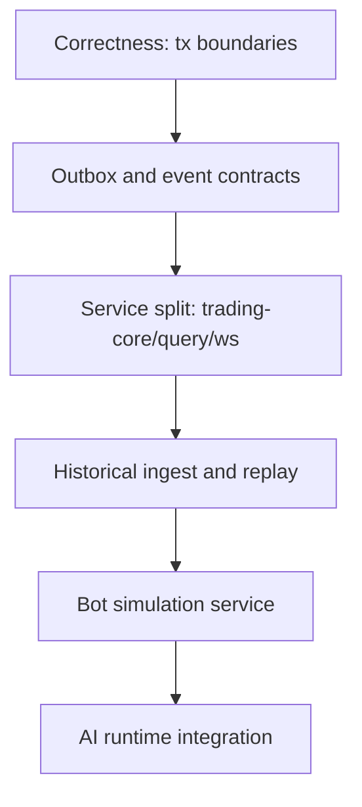

# Stage 0: Critical Path

Date: 2026-03-10
Status: Baseline

## Dependency Graph

## Critical Milestones

1. M1: Correctness hardening completed.
- Exit criteria: transactional command flows, no partial writes in critical use cases.

2. M2: Reliable eventing completed.
- Exit criteria: outbox relay, DLQ, schema governance, idempotent consumers.

3. M3: Service boundary split completed.
- Exit criteria: write path isolated from read/fan-out paths.

4. M4: Replay infrastructure completed.
- Exit criteria: deterministic replay from historical storage.

5. M5: Bot simulation platform completed.
- Exit criteria: concurrent runs, result persistence, guardrails.

## Gating Rules

1. No progression to M3 without M1 and M2 acceptance.
2. No production bot rollout without M4 and M5 load/chaos test pass.
3. Reliability regressions override feature delivery.
